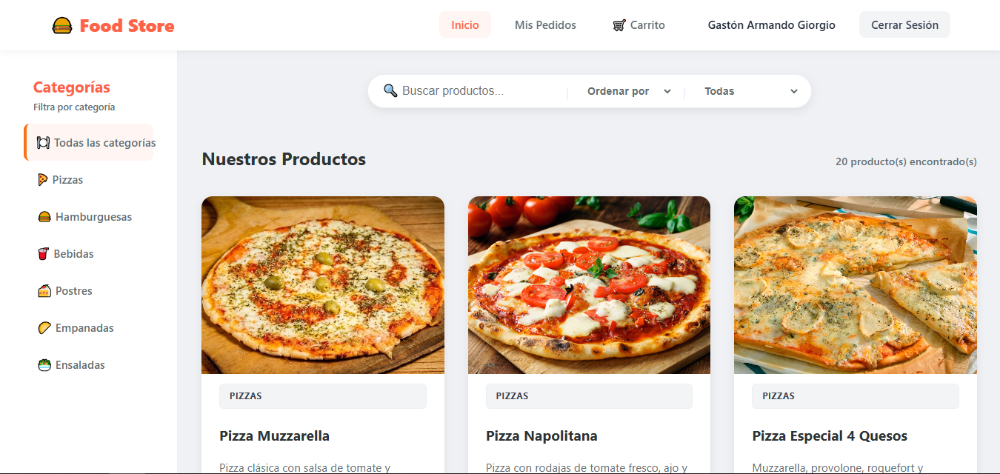
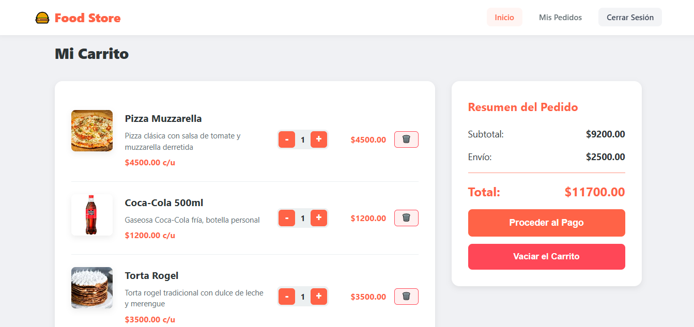
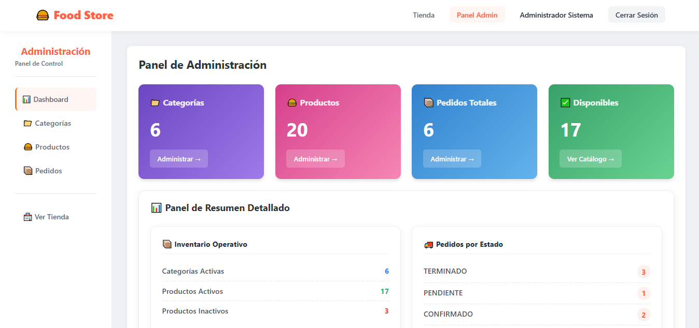
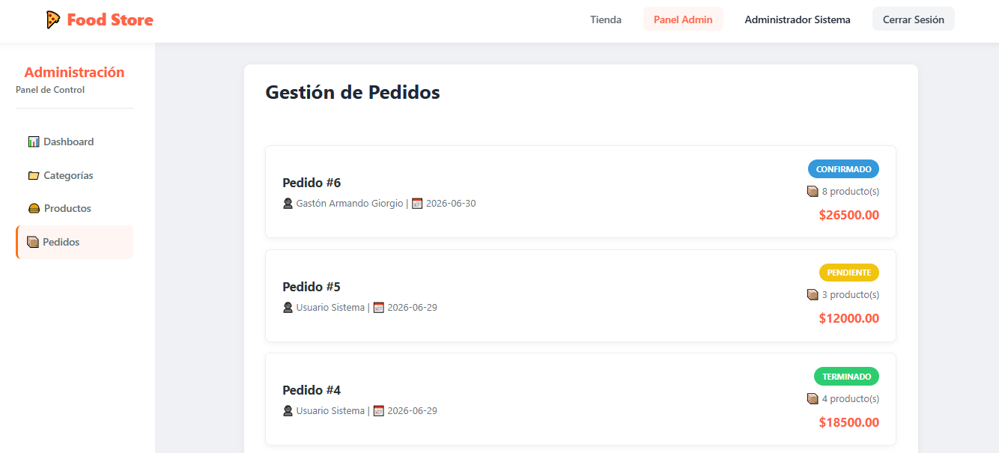
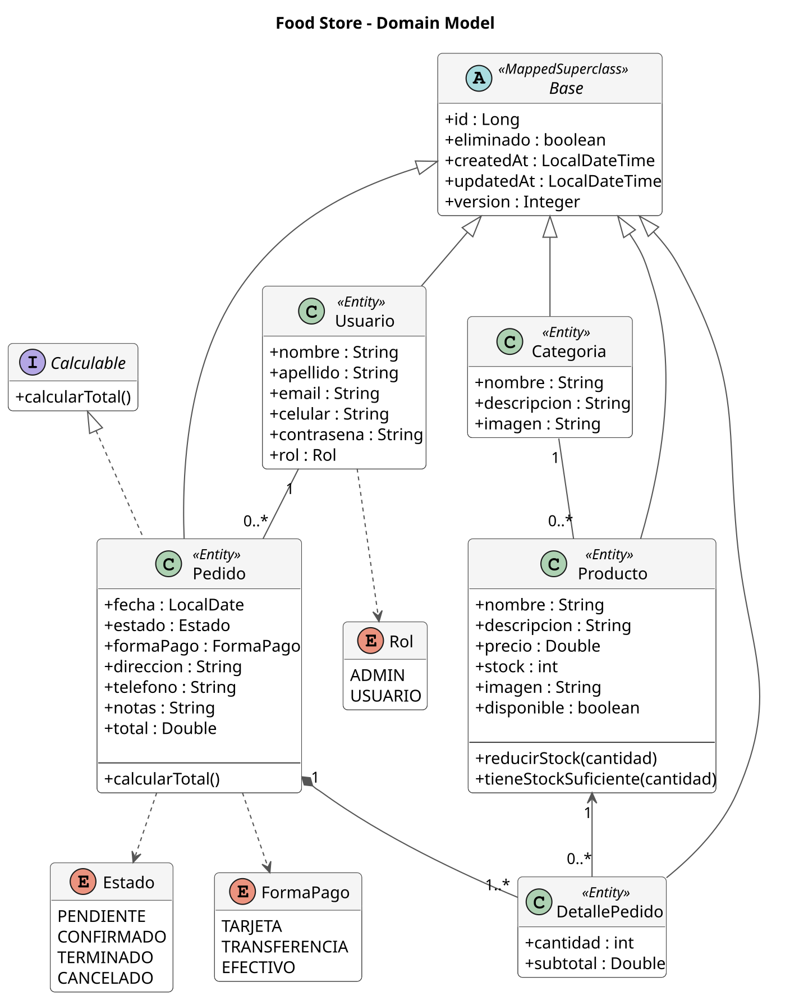

# 🍔 Food Store

<div align="center">

### Plataforma Full Stack de E-Commerce desarrollada con Java, Spring Boot, TypeScript y Docker

Proyecto personal basado en una arquitectura cliente-servidor con autenticación JWT, control de acceso por roles (RBAC) y despliegue completamente containerizado.


</div>

## 📑 Contenido

- [📖 Descripción](#-descripción)
- [📸 Capturas de Pantalla](#-capturas-de-pantalla)
- [✨ Características principales](#-características-principales)
- [🏗️ Arquitectura](#️-arquitectura)
- [🧰 Stack Tecnológico](#-stack-tecnológico)
- [📦 Arquitectura del Proyecto](#-arquitectura-del-proyecto)
- [✅ Conceptos Implementados](#-conceptos-implementados)
- [🗺️ Modelo de Dominio](#️-modelo-de-dominio)
- [📡 Referencia de la API](#-referencia-de-la-api-endpoints)
- [🐳 Despliegue y Ejecución](#-despliegue-y-ejecución-docker)
- [🧠 Aprendizajes](#-aprendizajes-y-habilidades-adquiridas)
- [👨‍💻 Autor](#-autor)

## 📖 Descripción

**Food Store** es una plataforma Full Stack de comercio electrónico desarrollada como evolución de un proyecto académico realizado para la Tecnicatura Universitaria en Programación (UTN).

Tras finalizar la materia, el proyecto fue completamente refactorizado para incorporar una arquitectura moderna basada en **Spring Boot 3**, **Spring Security 6**, **JWT**, **Docker** y una separación total entre Frontend y Backend mediante una **API REST Stateless**.

El objetivo fue transformar un trabajo práctico en un proyecto de portfolio que reflejara prácticas utilizadas en entornos profesionales de desarrollo.

Actualmente el sistema permite:

- Catálogo dinámico de productos.
- Carrito de compras persistente.
- Registro e inicio de sesión mediante JWT.
- Historial de pedidos.
- Panel administrativo.
- Gestión de productos, categorías y pedidos.
- Protección completa mediante Spring Security.
- Despliegue completo utilizando Docker Compose.

## 📸 Capturas de Pantalla

| 🛍️ Catálogo | 🛒 Carrito |
|:-----------:|:----------:|
|  |  |

| ⚙️ Dashboard | 📦 Gestión de Pedidos |
|:------------:|:---------------------:|
|  |  |

## ✨ Características principales

### 🔐 Seguridad

- Autenticación mediante JSON Web Tokens (JWT).
- Spring Security 6.
- Arquitectura Stateless.
- Control de acceso basado en roles (RBAC).
- Contraseñas protegidas mediante BCrypt.
- Filtro JWT personalizado (`OncePerRequestFilter`).

### 🛒 Portal del Cliente

- Catálogo dinámico.
- Búsqueda por nombre.
- Filtro por categorías.
- Ordenamiento por precio y nombre.
- Carrito persistente utilizando LocalStorage.
- Checkout protegido.
- Historial de pedidos.

### ⚙️ Panel Administrativo

- Dashboard administrativo.
- CRUD completo de Productos.
- CRUD completo de Categorías.
- Gestión de estados de pedidos.
- Métricas básicas del sistema.
- Seeders automáticos para datos de prueba.

## 🏗️ Arquitectura

El proyecto implementa una arquitectura cliente-servidor completamente desacoplada.

```text
                    Frontend (Vite + TypeScript)
                              │
                    Fetch API + JWT Bearer
                              │
                              ▼
                  Spring Boot REST API
                              │
                  Spring Security Filter
                              │
                      JWT Authentication
                              │
                 Controller → Service → Repository
                              │
                              ▼
                          MySQL 8
```

## 🧰 Stack Tecnológico

| Capa | Tecnologías |
|---|---|
| Frontend | TypeScript · HTML5 · CSS3 · Vite |
| Backend | Java 21 · Spring Boot 3.5 |
| Persistencia | Spring Data JPA · MySQL |
| Seguridad | Spring Security 6 · JWT · BCrypt |
| Documentación | OpenAPI (Swagger) |
| Contenedores | Docker · Docker Compose |
| Build Tools | Gradle · npm |

## 📦 Arquitectura del Proyecto

### Backend

- Arquitectura por capas.
- DTO Pattern.
- Repository Pattern.
- Bean Validation.
- Global Exception Handler.
- OpenAPI.
- Seeders automáticos.
- Herencia mediante entidad Base.
- Soft Delete.
- Auditoría de entidades.
- Optimistic Locking mediante versionado.

### Frontend

- Multi-Page Application (MPA).
- TypeScript estricto.
- Arquitectura modular.
- Organización por dominios (Auth, Store, Client y Admin).
- Wrapper centralizado para llamadas HTTP.
- Gestión de sesión mediante JWT.
- Persistencia de carrito utilizando LocalStorage.

## 📂 Estructura del Proyecto

```text
Food-Store/
│
├── backend/              # API REST desarrollada con Spring Boot
│   ├── src/main/java
│   ├── src/main/resources
│   └── Dockerfile
│
├── frontend/             # Aplicación MPA desarrollada con Vite + TypeScript
│   ├── src/
│   └── Dockerfile
│
├── assets/               # Capturas y recursos para la documentación
├── docker-compose.yml    # Orquestación de contenedores
├── .env.example          # Variables de entorno de ejemplo
└── README.md
```

## ✅ Conceptos Implementados

Durante el desarrollo de Food Store se aplicaron distintos patrones, tecnologías y buenas prácticas utilizadas en aplicaciones empresariales:

- ✔ Arquitectura en Capas (Layered Architecture)
- ✔ API REST Stateless
- ✔ DTO Pattern
- ✔ Repository Pattern
- ✔ Dependency Injection
- ✔ Bean Validation
- ✔ Global Exception Handler
- ✔ Spring Security 6
- ✔ Autenticación mediante JWT
- ✔ Control de Acceso por Roles (RBAC)
- ✔ BCrypt Password Hashing
- ✔ OpenAPI (Swagger)
- ✔ Soft Delete
- ✔ Auditoría de Entidades
- ✔ Optimistic Locking
- ✔ Multi-Stage Docker Builds
- ✔ Docker Compose
- ✔ Multi-Page Application (MPA)
- ✔ Wrapper HTTP para consumo centralizado de la API

## 🗺️ Modelo de Dominio

El dominio del sistema fue modelado utilizando **JPA/Hibernate**, aplicando relaciones entre entidades, herencia mediante una clase base y encapsulación de reglas de negocio a través de interfaces y lógica de dominio.


### Diagrama UML del Modelo de Dominio

El siguiente diagrama representa la estructura de entidades del sistema, sus relaciones JPA, la herencia desde la clase base y la utilización de enumeraciones e interfaces del dominio.

<p align="center">
  
</p>

### Relaciones principales

- **Categoría → Producto** (1:N)
- **Usuario → Pedido** (1:N)
- **Pedido → DetallePedido** (1:N)
- **Producto → DetallePedido** (1:N)

Todas las entidades heredan de una clase base (`Base`) que centraliza:

- Identificador único.
- Auditoría (`createdAt` y `updatedAt`).
- Soft Delete.
- Control de concurrencia mediante **Optimistic Locking**.

## 📡 Referencia de la API (Endpoints)

La API RESTful está documentada con OpenAPI (Swagger). A continuación se detallan los endpoints principales del sistema, protegidos mediante Spring Security:

| Módulo | Método | Endpoint | Descripción | Acceso |
|---|---|---|---|---|
| Auth | POST | `/api/auth/login` | Autenticación y generación de token JWT | 🌐 Público |
| Auth | POST | `/api/auth/register` | Registro de un nuevo cliente | 🌐 Público |
| Catálogo | GET | `/api/products` | Obtener listado de productos disponibles | 🌐 Público |
| Catálogo | GET | `/api/categories` | Obtener listado de categorías | 🌐 Público |
| Admin | POST | `/api/products` | Crear un nuevo producto en el catálogo | 🛡️ ADMIN |
| Admin | PUT | `/api/products/{id}` | Modificar atributos de un producto existente | 🛡️ ADMIN |
| Admin | DELETE | `/api/products/{id}` | Baja lógica de un producto (Soft Delete) | 🛡️ ADMIN |
| Pedidos | POST | `/api/orders` | Registrar una nueva orden de compra (Checkout) | 👤 CLIENT |
| Pedidos | GET | `/api/orders/user/{id}` | Consultar el historial de pedidos de un usuario | 👤 CLIENT |
| Pedidos | PUT | `/api/orders/{id}` | Actualizar el estado transaccional de un pedido | 🛡️ ADMIN |

## 🐳 Despliegue y Ejecución (Docker)

El proyecto está preparado para levantar toda su infraestructura (Backend, Frontend y Base de Datos) de forma automatizada mediante contenedores, facilitando la configuración del entorno y proporcionando una ejecución reproducible entre distintos entornos de desarrollo.


### Requisitos

- Docker Engine y Docker Compose (o Docker Desktop).

### 💡 Nota para entornos sin interfaz gráfica (CLI pura)

Si estás en Windows y prefieres iniciar el motor de Docker en segundo plano sin abrir la interfaz de Docker Desktop, puedes ejecutar esto en tu terminal (PowerShell):

```powershell
Start-Process -FilePath "C:\Program Files\Docker\Docker\Docker Desktop.exe" -WindowStyle Hidden
```

### Pasos para iniciar

#### 1- Clonar el repositorio:

```bash
git clone https://github.com/gastongiorgio/Food-Store_TPI_Programacion-3.git

cd Food-Store_TPI_Programacion-3
```

#### 2- Configurar el entorno:

Crea el archivo de variables a partir del ejemplo. El archivo `.env.example` contiene valores de configuración destinados exclusivamente al desarrollo local, que deben reemplazarse antes de utilizar la aplicación en otros entornos:


```bash
cp .env.example .env
```

#### 3- Levantar la infraestructura completa

El siguiente comando construye las imágenes y levanta automáticamente:

- MySQL 8
- Backend (Spring Boot)
- Frontend (Nginx)

```bash
docker compose up -d --build
```

### Accesos del Sistema

Una vez finalizada la construcción de las imágenes, los servicios estarán disponibles en:

| Servicio | Acceso |
|---|---|
| Aplicación Web (Nginx) | http://localhost:5173 |
| Documentación API (Swagger) | http://localhost:8080/swagger-ui/index.html |
| Base de Datos MySQL | Puerto 3306 (Accesible desde DBeaver/Workbench). |

Para apagar la infraestructura ordenadamente manteniendo los datos almacenados de forma segura en los volúmenes:

```bash
docker compose down
```

## 🧠 Aprendizajes y Habilidades Adquiridas

El desarrollo de Food Store me permitió profundizar en distintas áreas del desarrollo Full Stack, enfrentando problemas similares a los que pueden aparecer en un proyecto real.

- **Arquitectura de Seguridad:** Configuré Spring Security 6 desde cero, comprendiendo el ciclo de vida de una petición HTTP, la construcción del *Security Filter Chain*, la gestión de sesiones Stateless y la autenticación mediante JWT.

- **Containerización y Orquestación:** Aprendí a empaquetar aplicaciones Java y TypeScript utilizando **Multi-stage Builds**, orquestando toda la infraestructura mediante **Docker Compose**, con persistencia de datos, redes privadas y dependencias entre servicios.

- **Arquitectura Frontend (MPA):** Resolví las diferencias entre el entorno de desarrollo de Vite y el despliegue en producción con Nginx, configurando correctamente los *entry points* de una aplicación Multi-Page.

- **Consumo de APIs:** Implementé un *HTTP Wrapper* centralizado para gestionar autenticación, inyección automática del token JWT y manejo uniforme de errores entre el Frontend y el Backend.

- **Buenas Prácticas de Desarrollo:** Incorporé patrones de diseño, arquitectura en capas, DTOs, validaciones, manejo global de excepciones, documentación con OpenAPI y control de versiones mediante Git.

## 👨‍💻 Autor

Gastón Armando Giorgio

Full Stack Developer con mayor experiencia práctica en Backend | Estudiante de la Tecnicatura Universitaria en Programación (UTN).


📍 Mendoza, Argentina.

Proyecto desarrollado con dedicación para consolidar los fundamentos de la ingeniería de software, la arquitectura en capas y el despliegue moderno.

⭐ Si este proyecto te resultó interesante, no olvides dejar una estrella en el repositorio.
